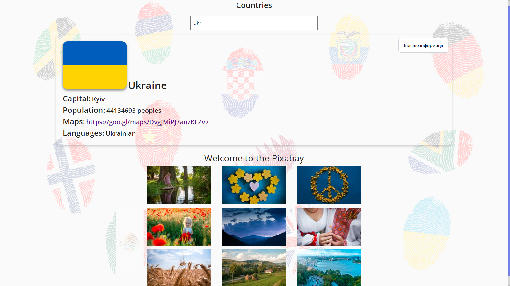

# Incredible-JS

## Stack of technologies:

## Project description

#### Сайт пошуку країн та зображень країн

`Опис проекту` Сайт пошуку країн та зображень країн є веб-додатком, який надає
користувачам можливість знаходити інформацію про різні країни світу та
переглядати фотографії, пов'язані з цими країнами. Проект включає в себе такі
ключові функції:

`Основні функції` Пошук країни: Користувачі можуть шукати країни за їх назвою.

`Детальна інформація про країну:` Після вибору країни користувач отримує доступ
до важливої інформації, такої як столиця, площа, населення, регіони, мови і
багато іншого.

`Картинки країни:` Користувач може переглядати зображення країни, які
відображаються в галереї на сторінці країни.

`Мапа країни`: На сторінці країни відображається карта, яка показує місце
розташування цієї країни на світовій карті.

`Технічні деталі` Фронтенд: Додаток розроблений з використанням технологій HTML,
CSS та JavaScript. Бекенд: Для отримання даних про країни та зображення
використовується зовнішній RESTful API. База даних: Проект не має власної бази
даних, всі дані отримуються через API.

`Особисті переваги` Проект надає користувачам зручний інтерфейс для пошуку країн
та перегляду інформації про них. Зображення країн допомагають користувачам
отримати візуальне уявлення про країни.

`Посилання` Перейти на сайт: Ви можете відвідати наш веб-сайт та спробувати всі
його функції. https://dmytro1117.github.io/incredible-js/
